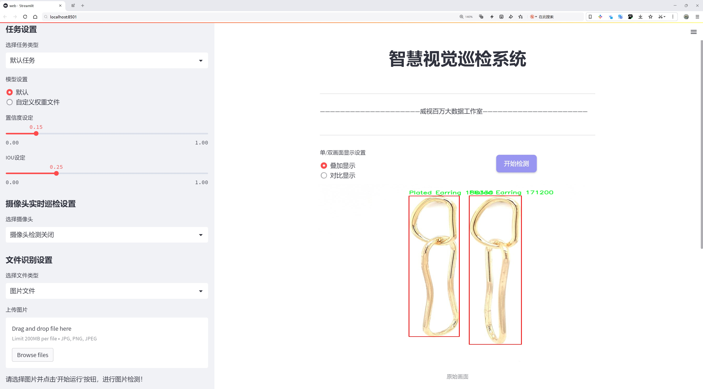
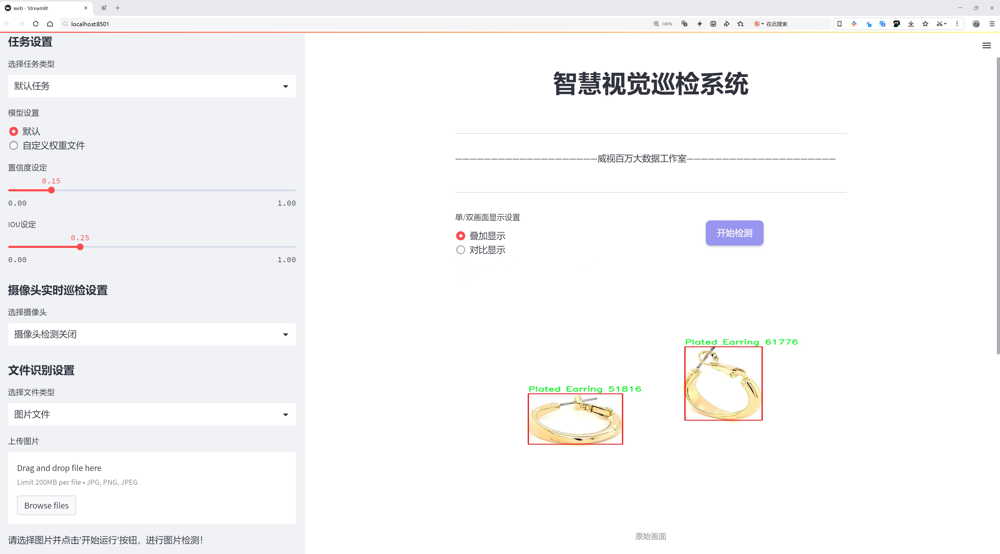
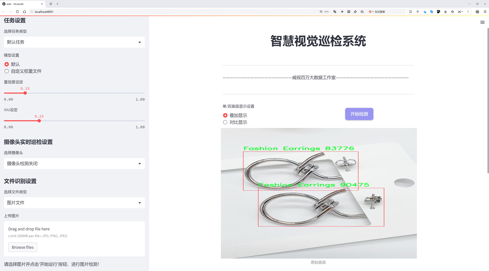
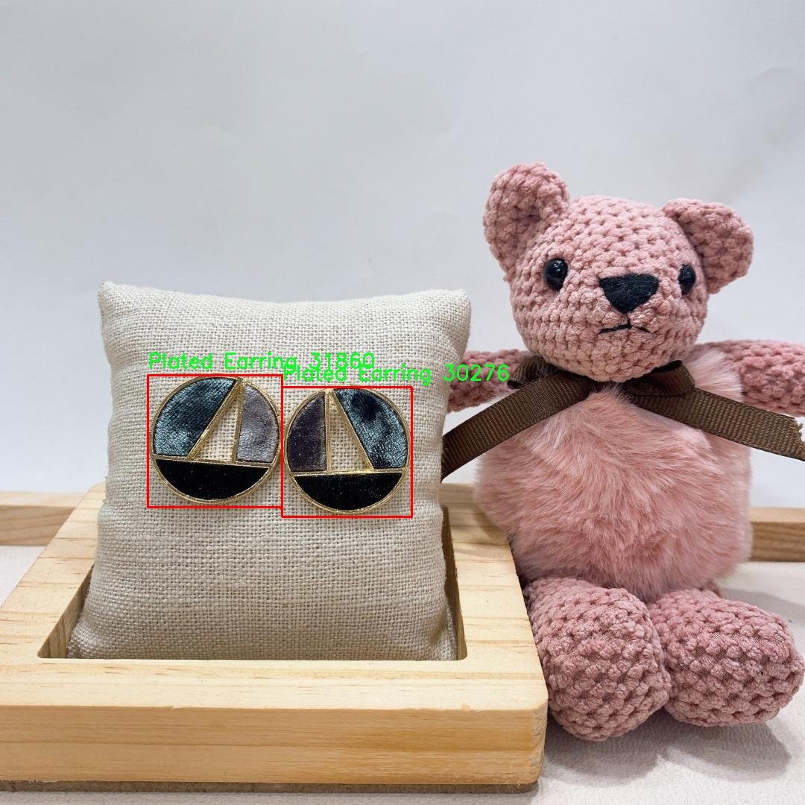
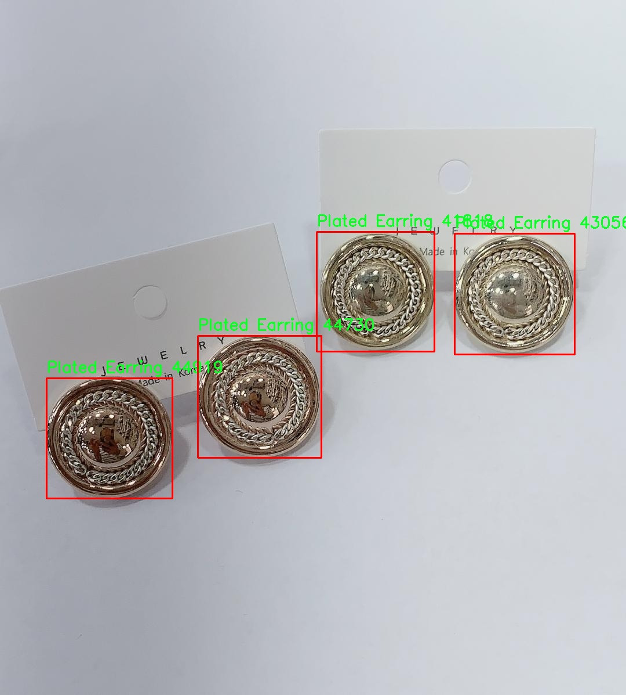
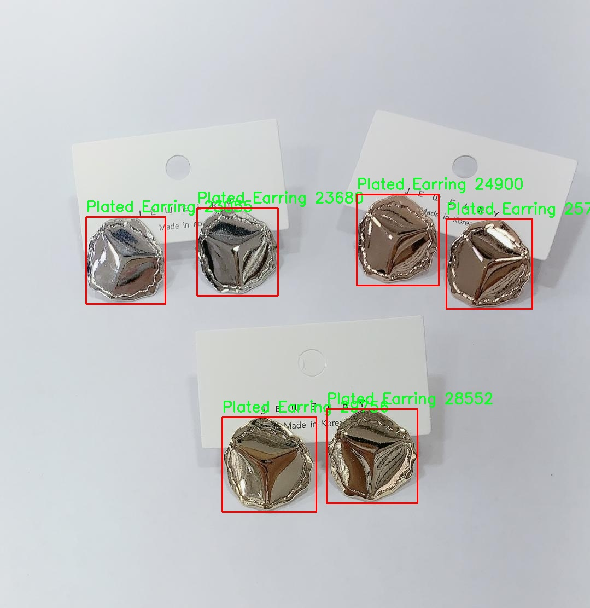
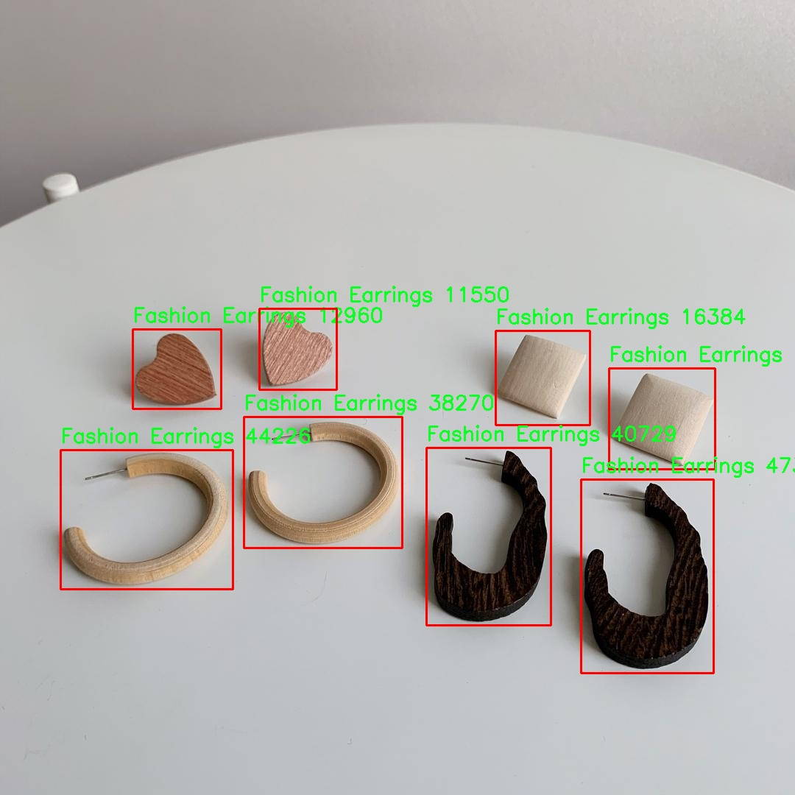

# 珠宝首饰检测检测系统源码分享
 # [一条龙教学YOLOV8标注好的数据集一键训练_70+全套改进创新点发刊_Web前端展示]

### 1.研究背景与意义

项目参考[AAAI Association for the Advancement of Artificial Intelligence](https://gitee.com/qunshansj/projects)

项目来源[AACV Association for the Advancement of Computer Vision](https://gitee.com/qunmasj/projects)

研究背景与意义

随着电子商务的迅猛发展，珠宝首饰行业也迎来了前所未有的机遇与挑战。消费者对珠宝首饰的需求日益增加，尤其是在网络购物的环境下，如何快速、准确地识别和分类大量的珠宝首饰产品，成为了行业内亟待解决的问题。传统的人工识别方法不仅效率低下，而且容易受到人为因素的影响，导致识别结果的不准确性。因此，基于计算机视觉的自动化检测系统应运而生，成为提升珠宝首饰检测效率和准确性的有效手段。

在众多计算机视觉技术中，YOLO（You Only Look Once）系列模型因其高效的实时目标检测能力而备受关注。YOLOv8作为该系列的最新版本，结合了深度学习的先进技术，能够在保持高精度的同时实现快速检测。然而，针对珠宝首饰这一特定领域，YOLOv8的标准模型可能无法完全满足实际应用需求。因此，基于YOLOv8的改进方案显得尤为重要。通过对模型进行针对性的优化，可以提升其在珠宝首饰检测中的表现，尤其是在复杂背景和多样化样式的情况下。

本研究的核心在于构建一个基于改进YOLOv8的珠宝首饰检测系统，旨在实现对不同类别珠宝首饰的高效识别与分类。为此，我们将使用一个包含4200张图像的数据集，该数据集涵盖了五种主要的珠宝首饰类别：立方体和玻璃耳环、时尚耳环、珍珠耳环、电镀耳环和银针耳环。这些类别的多样性不仅反映了市场的广泛需求，也为模型的训练提供了丰富的样本。通过对这些数据的深入分析与处理，我们希望能够提高模型在特定珠宝首饰检测任务中的准确性和鲁棒性。

此外，珠宝首饰的检测系统不仅仅是一个技术问题，更是一个商业问题。高效的检测系统能够帮助商家快速识别产品，优化库存管理，提升客户体验，从而在竞争激烈的市场中占据优势。同时，消费者也能够通过这一系统更方便地找到自己喜爱的珠宝首饰，提升购物的满意度。因此，本研究不仅具有重要的学术价值，也具备显著的应用前景。

综上所述，基于改进YOLOv8的珠宝首饰检测系统的研究，不仅能够推动计算机视觉技术在实际应用中的发展，也为珠宝首饰行业的数字化转型提供了有力支持。通过实现高效、准确的自动化检测，我们期待能够为行业带来新的变革，助力珠宝首饰市场的进一步发展。

### 2.图片演示







##### 注意：由于此博客编辑较早，上面“2.图片演示”和“3.视频演示”展示的系统图片或者视频可能为老版本，新版本在老版本的基础上升级如下：（实际效果以升级的新版本为准）

  （1）适配了YOLOV8的“目标检测”模型和“实例分割”模型，通过加载相应的权重（.pt）文件即可自适应加载模型。

  （2）支持“图片识别”、“视频识别”、“摄像头实时识别”三种识别模式。

  （3）支持“图片识别”、“视频识别”、“摄像头实时识别”三种识别结果保存导出，解决手动导出（容易卡顿出现爆内存）存在的问题，识别完自动保存结果并导出到tempDir中。

  （4）支持Web前端系统中的标题、背景图等自定义修改，后面提供修改教程。

  另外本项目提供训练的数据集和训练教程,暂不提供权重文件（best.pt）,需要您按照教程进行训练后实现图片演示和Web前端界面演示的效果。

### 3.视频演示

[3.1 视频演示](https://www.bilibili.com/video/BV1MEtieyEij/)

### 4.数据集信息展示

##### 4.1 本项目数据集详细数据（类别数＆类别名）

nc: 5
names: ['Cubic - Glass Earrings', 'Fashion Earrings', 'Pearl Earring', 'Plated Earring', 'Silver Needle Earring']


##### 4.2 本项目数据集信息介绍

数据集信息展示

在本研究中，我们使用了名为“heydome”的数据集，以训练和改进YOLOv8模型在珠宝首饰检测任务中的表现。该数据集专注于五种不同类型的耳环，旨在为计算机视觉领域提供丰富的样本，以提升自动检测和分类的准确性。数据集的类别数量为五，具体包括：Cubic - Glass Earrings、Fashion Earrings、Pearl Earring、Plated Earring和Silver Needle Earring。这些类别不仅涵盖了耳环的多样性，还体现了珠宝首饰设计的复杂性和美学特征。

“heydome”数据集的设计考虑到了珠宝首饰的实际应用场景，样本图像均经过精心挑选，确保每一类耳环的特征都能得到充分展示。Cubic - Glass Earrings类别的耳环通常以其独特的几何形状和光泽感而受到青睐，数据集中包含了多种颜色和形状的样本，帮助模型学习到如何识别不同的设计元素。Fashion Earrings则代表了当前流行趋势，样本图像中展示了各种时尚风格的耳环，涵盖了从简约到复杂的设计，确保模型能够适应快速变化的时尚市场。

Pearl Earring类别则以其经典的优雅著称，数据集中包含了多种珍珠耳环的图像，展示了不同大小、形状和配件的组合。这一类别的样本不仅突出了珍珠的光泽和质感，还展示了与其他材料的搭配效果，为模型提供了丰富的视觉信息。Plated Earring类别则聚焦于镀金或镀银的耳环，这些耳环通常具有较高的性价比，样本图像展示了多种流行的设计，帮助模型识别出这些耳环的独特特征。最后，Silver Needle Earring类别则以其简约的设计和高雅的外观受到消费者的喜爱，数据集中包含了多种银针耳环的样本，确保模型能够准确识别出这一经典款式。

通过对“heydome”数据集的深入分析，我们能够提取出每个类别的关键特征，从而为YOLOv8模型的训练提供强有力的支持。数据集中的图像质量高，标注准确，确保了模型在训练过程中的有效性和可靠性。此外，数据集的多样性使得模型能够在实际应用中具备更强的泛化能力，能够适应不同的环境和条件下的珠宝首饰检测任务。

总之，“heydome”数据集为改进YOLOv8的珠宝首饰检测系统提供了丰富的资源和坚实的基础。通过对五种耳环类别的深入学习，模型将能够在复杂的实际场景中实现高效、准确的检测，为珠宝行业的自动化和智能化发展贡献力量。随着数据集的不断扩展和优化，我们期待在未来的研究中进一步提升模型的性能，推动珠宝首饰检测技术的进步。










### 5.全套项目环境部署视频教程（零基础手把手教学）

[5.1 环境部署教程链接（零基础手把手教学）](https://www.ixigua.com/7404473917358506534?logTag=c807d0cbc21c0ef59de5)


[5.2 安装Python虚拟环境创建和依赖库安装视频教程链接（零基础手把手教学）](https://www.ixigua.com/7404474678003106304?logTag=1f1041108cd1f708b01a)

### 6.手把手YOLOV8训练视频教程（零基础小白有手就能学会）

[6.1 手把手YOLOV8训练视频教程（零基础小白有手就能学会）](https://www.ixigua.com/7404477157818401292?logTag=d31a2dfd1983c9668658)

### 7.70+种全套YOLOV8创新点代码加载调参视频教程（一键加载写好的改进模型的配置文件）

[7.1 70+种全套YOLOV8创新点代码加载调参视频教程（一键加载写好的改进模型的配置文件）](https://www.ixigua.com/7404478314661806627?logTag=29066f8288e3f4eea3a4)

### 8.70+种全套YOLOV8创新点原理讲解（非科班也可以轻松写刊发刊，V10版本正在科研待更新）

由于篇幅限制，每个创新点的具体原理讲解就不一一展开，具体见下列网址中的创新点对应子项目的技术原理博客网址【Blog】：


[8.1 70+种全套YOLOV8创新点原理讲解链接](https://gitee.com/qunmasj/good)

### 9.系统功能展示（检测对象为举例，实际内容以本项目数据集为准）

图9.1.系统支持检测结果表格显示

  图9.2.系统支持置信度和IOU阈值手动调节

  图9.3.系统支持自定义加载权重文件best.pt(需要你通过步骤5中训练获得)

  图9.4.系统支持摄像头实时识别

  图9.5.系统支持图片识别

  图9.6.系统支持视频识别

  图9.7.系统支持识别结果文件自动保存

  图9.8.系统支持Excel导出检测结果数据


### 10.原始YOLOV8算法原理

原始YOLOv8算法原理

YOLOv8作为目标检测领域的最新版本，承载着YOLO系列算法的进化与创新，代表了当前最前沿的技术水平。自2015年YOLO模型首次提出以来，经过多个版本的迭代，YOLOv8在推理速度、检测精度、训练便利性及硬件兼容性等方面均表现出色，成为了行业内广泛应用的标准之一。其架构设计可分为三个主要部分：Backbone（骨干网络）、Neck（颈部结构）和Head（头部结构），每个部分在整个目标检测流程中扮演着不可或缺的角色。

在YOLOv8的Backbone部分，模型通过一系列卷积操作对输入图像进行特征提取。具体而言，输入图像首先经过缩放处理，以满足网络对输入尺寸的要求。接着，Backbone利用多个卷积层进行下采样，每个卷积层都配备了批归一化和SiLU激活函数，这不仅提高了模型的非线性表达能力，还加速了收敛过程。为了进一步增强特征提取的效果，YOLOv8引入了C2f模块，该模块借鉴了YOLOv7中的E-ELAN结构，通过跨层分支连接来改善模型的梯度流动，从而有效提升了检测性能。此外，Backbone的末尾采用了SPPFl模块，利用多个最大池化层处理多尺度特征，增强了网络的特征抽象能力，使得模型能够更好地适应不同尺寸的目标。

在Neck部分，YOLOv8采用了FPNS（Feature Pyramid Network）和PAN（Path Aggregation Network）结构，这两种结构的结合使得不同尺度的特征图能够有效融合。FPNS通过上采样和下采样的方式，确保了高层特征与低层特征之间的信息传递，而PAN则通过特征拼接进一步增强了特征的表达能力。这种特征融合策略使得YOLOv8在处理复杂场景时，能够更好地捕捉到目标的细节信息，从而提高了检测的准确性。

最后，在Head部分，YOLOv8采用了解耦的检测头结构，分别计算回归和分类的损失。传统的目标检测方法通常将这两个任务耦合在一起，而YOLOv8通过将其解耦，使得模型在处理每个任务时能够更加专注，从而提升了整体性能。具体而言，Head部分包含两个并行的卷积分支，分别负责目标的类别预测和位置回归。这样的设计不仅提高了模型的灵活性，还使得在训练过程中，分类损失和回归损失的计算可以更加独立，从而优化了模型的学习过程。

YOLOv8的模型设置也相当灵活，用户可以通过调整depth_factor、width_factor和ratio等参数，来控制模型的深度和宽度。这种灵活性使得YOLOv8能够适应不同的应用场景，无论是需要高精度的任务，还是对推理速度有严格要求的实时应用，YOLOv8都能提供相应的解决方案。具体来说，depth_factor决定了模型的层数，width_factor则影响每层的通道数，而ratio参数则控制基础通道数的倍数。这种可调性不仅提高了模型的适应性，也为用户提供了更多的选择空间。

值得注意的是，YOLOv8在目标检测领域的表现得益于其采用的anchor-free方法。与传统的anchor-based方法相比，anchor-free方法能够更高效地处理目标检测任务，尤其是在复杂的背景下。尽管如此，在一些特定的应用场景中，例如复杂水面环境下的小目标检测，YOLOv8仍然面临着定位误差和目标感知能力不足的挑战。因此，针对这些问题，研究者们提出了YOLOv8-WSSOD算法，通过引入BiFormer双层路由注意力机制、添加更小的检测头以及优化损失函数等手段，进一步提升了YOLOv8在特定场景下的表现。

综上所述，YOLOv8不仅在技术上实现了多项创新，其灵活的架构设计和高效的特征处理能力，使其在目标检测领域中占据了重要的地位。通过不断的优化与改进，YOLOv8为研究者和工程师提供了一个强大的工具，以应对日益复杂的视觉识别任务。随着技术的不断进步，YOLOv8无疑将在未来的应用中展现出更大的潜力与价值。


### 11.项目核心源码讲解（再也不用担心看不懂代码逻辑）

#### 11.1 code\ultralytics\models\yolo\pose\predict.py

以下是对代码的核心部分进行分析和详细注释的结果：

```python
# 导入必要的模块和类
from ultralytics.engine.results import Results
from ultralytics.models.yolo.detect.predict import DetectionPredictor
from ultralytics.utils import DEFAULT_CFG, LOGGER, ops

class PosePredictor(DetectionPredictor):
    """
    PosePredictor类扩展了DetectionPredictor类，用于基于姿态模型的预测。
    
    示例用法：
        ```python
        from ultralytics.utils import ASSETS
        from ultralytics.models.yolo.pose import PosePredictor

        args = dict(model='yolov8n-pose.pt', source=ASSETS)
        predictor = PosePredictor(overrides=args)
        predictor.predict_cli()
        ```
    """

    def __init__(self, cfg=DEFAULT_CFG, overrides=None, _callbacks=None):
        """初始化PosePredictor，设置任务为'pose'并记录使用'mps'作为设备的警告信息。"""
        super().__init__(cfg, overrides, _callbacks)  # 调用父类构造函数
        self.args.task = "pose"  # 设置任务类型为姿态检测
        # 检查设备类型，如果是'mps'，则发出警告
        if isinstance(self.args.device, str) and self.args.device.lower() == "mps":
            LOGGER.warning(
                "WARNING ⚠️ Apple MPS known Pose bug. Recommend 'device=cpu' for Pose models. "
                "See https://github.com/ultralytics/ultralytics/issues/4031."
            )

    def postprocess(self, preds, img, orig_imgs):
        """返回给定输入图像或图像列表的检测结果。"""
        # 对预测结果进行非极大值抑制，过滤掉低置信度的框
        preds = ops.non_max_suppression(
            preds,
            self.args.conf,  # 置信度阈值
            self.args.iou,  # IOU阈值
            agnostic=self.args.agnostic_nms,  # 是否类别无关的NMS
            max_det=self.args.max_det,  # 最大检测框数量
            classes=self.args.classes,  # 过滤的类别
            nc=len(self.model.names),  # 类别数量
        )

        # 如果输入图像不是列表，则将其转换为numpy数组
        if not isinstance(orig_imgs, list):  # 输入图像是torch.Tensor，而不是列表
            orig_imgs = ops.convert_torch2numpy_batch(orig_imgs)

        results = []  # 存储最终结果的列表
        for i, pred in enumerate(preds):
            orig_img = orig_imgs[i]  # 获取原始图像
            # 调整预测框的坐标到原始图像的尺寸
            pred[:, :4] = ops.scale_boxes(img.shape[2:], pred[:, :4], orig_img.shape).round()
            # 获取关键点预测并调整其坐标
            pred_kpts = pred[:, 6:].view(len(pred), *self.model.kpt_shape) if len(pred) else pred[:, 6:]
            pred_kpts = ops.scale_coords(img.shape[2:], pred_kpts, orig_img.shape)
            img_path = self.batch[0][i]  # 获取图像路径
            # 将结果存储到Results对象中
            results.append(
                Results(orig_img, path=img_path, names=self.model.names, boxes=pred[:, :6], keypoints=pred_kpts)
            )
        return results  # 返回所有结果
```

### 代码分析：
1. **PosePredictor类**：该类继承自`DetectionPredictor`，专门用于姿态检测任务。构造函数中设置了任务类型，并对设备类型进行检查以避免潜在的bug。

2. **postprocess方法**：该方法用于处理模型的预测结果。它首先对预测框进行非极大值抑制，以去除冗余的检测框。然后，将预测框和关键点的坐标调整到原始图像的尺寸，并将结果存储在`Results`对象中，最终返回这些结果。

### 关键功能：
- **非极大值抑制**：用于过滤低置信度的检测框，提升检测结果的准确性。
- **坐标调整**：将模型输出的框和关键点坐标转换为原始图像的坐标，确保结果的可用性。
- **结果封装**：使用`Results`类封装最终的检测结果，便于后续处理和展示。

这个文件定义了一个名为 `PosePredictor` 的类，它是从 `DetectionPredictor` 类扩展而来的，主要用于基于姿态模型进行预测。文件的开头部分包含了版权信息和必要的导入语句，导入了与结果处理、检测预测和一些工具函数相关的模块。

在 `PosePredictor` 类的构造函数 `__init__` 中，首先调用了父类的构造函数，并设置任务类型为“pose”。如果设备类型被设置为“mps”（即苹果的金属性能着色器），则会发出警告，提示用户可能会遇到已知的姿态模型问题，并建议使用“cpu”作为设备。

类中还有一个名为 `postprocess` 的方法，该方法用于处理给定输入图像或图像列表的检测结果。首先，它使用非极大值抑制（NMS）对预测结果进行过滤，以消除冗余的检测框。接着，如果输入的原始图像不是列表格式（即是一个张量），则将其转换为NumPy数组格式。

然后，方法遍历每个预测结果，获取对应的原始图像，并将预测框的坐标进行缩放，以适应原始图像的尺寸。对于关键点的处理，首先将其重塑为模型定义的形状，然后同样进行坐标缩放。最后，构建一个 `Results` 对象，将原始图像、图像路径、检测框和关键点信息封装在一起，并将所有结果存储在一个列表中返回。

总的来说，这个文件的主要功能是实现基于姿态模型的预测，处理输入图像并返回检测结果，适用于姿态估计的应用场景。

#### 11.2 ui.py

```python
import sys
import subprocess

def run_script(script_path):
    """
    使用当前 Python 环境运行指定的脚本。

    Args:
        script_path (str): 要运行的脚本路径

    Returns:
        None
    """
    # 获取当前 Python 解释器的路径
    python_path = sys.executable

    # 构建运行命令，使用 streamlit 运行指定的脚本
    command = f'"{python_path}" -m streamlit run "{script_path}"'

    # 执行命令并等待其完成
    result = subprocess.run(command, shell=True)
    
    # 检查命令执行结果，如果返回码不为0，则表示出错
    if result.returncode != 0:
        print("脚本运行出错。")


# 实例化并运行应用
if __name__ == "__main__":
    # 指定要运行的脚本路径
    script_path = "web.py"  # 这里可以直接指定脚本名，假设它在当前目录

    # 调用函数运行脚本
    run_script(script_path)
```

### 代码注释说明：
1. **导入模块**：
   - `sys`：用于获取当前 Python 解释器的路径。
   - `subprocess`：用于执行外部命令。

2. **`run_script` 函数**：
   - 功能：在当前 Python 环境中运行指定的脚本。
   - 参数：`script_path` 是要运行的脚本的路径。
   - 使用 `sys.executable` 获取当前 Python 解释器的路径，以确保使用正确的 Python 环境。
   - 构建命令字符串，使用 `streamlit` 模块运行指定的脚本。
   - 使用 `subprocess.run` 执行命令，并通过 `shell=True` 允许在 shell 中执行。
   - 检查命令的返回码，如果不为0，表示脚本运行出错，并打印错误信息。

3. **主程序部分**：
   - 通过 `if __name__ == "__main__":` 确保该部分代码仅在直接运行脚本时执行。
   - 指定要运行的脚本路径（这里假设脚本名为 `web.py`）。
   - 调用 `run_script` 函数，执行指定的脚本。

这个程序文件名为 `ui.py`，其主要功能是通过当前的 Python 环境来运行一个指定的脚本。代码首先导入了必要的模块，包括 `sys`、`os` 和 `subprocess`，以及一个自定义的路径处理模块 `abs_path`。

在 `run_script` 函数中，首先获取当前 Python 解释器的路径，使用 `sys.executable` 来实现。接着，构建一个命令字符串，这个命令将使用 `streamlit` 来运行指定的脚本。命令的格式是 `"{python_path}" -m streamlit run "{script_path}"`，其中 `python_path` 是当前 Python 解释器的路径，`script_path` 是要运行的脚本路径。

然后，使用 `subprocess.run` 方法来执行这个命令，`shell=True` 参数允许在 shell 中执行命令。执行后，程序会检查返回的状态码，如果返回码不为零，表示脚本运行出错，此时会打印出“脚本运行出错。”的提示信息。

在文件的最后部分，使用 `if __name__ == "__main__":` 来确保只有在直接运行该脚本时才会执行后面的代码。在这里，首先调用 `abs_path` 函数来获取名为 `web.py` 的脚本的绝对路径，然后调用 `run_script` 函数来运行这个脚本。

整体来看，这个程序的目的是为了方便地通过 Python 环境来运行一个 Streamlit 应用脚本，并处理可能出现的错误。

#### 11.3 70+种YOLOv8算法改进源码大全和调试加载训练教程（非必要）\ultralytics\engine\model.py

以下是经过简化并添加详细中文注释的核心代码部分：

```python
import torch
from pathlib import Path
from typing import Union
from ultralytics.nn.tasks import nn, attempt_load_one_weight, guess_model_task, yaml_model_load
from ultralytics.utils import callbacks, checks, ASSETS, LOGGER

class Model(nn.Module):
    """
    统一所有模型API的基类。

    参数:
        model (str, Path): 要加载或创建的模型文件路径。
        task (Any, optional): YOLO模型的任务类型。默认为None。
    """

    def __init__(self, model: Union[str, Path] = 'yolov8n.pt', task=None) -> None:
        """
        初始化YOLO模型。

        参数:
            model (Union[str, Path], optional): 要加载或创建的模型路径或名称。默认为'yolov8n.pt'。
            task (Any, optional): YOLO模型的任务类型。默认为None。
        """
        super().__init__()
        self.callbacks = callbacks.get_default_callbacks()  # 获取默认回调
        self.model = None  # 模型对象
        self.task = task  # 任务类型
        model = str(model).strip()  # 去除空格

        # 检查是否为Ultralytics HUB模型
        if self.is_hub_model(model):
            from ultralytics.hub.session import HUBTrainingSession
            self.session = HUBTrainingSession(model)  # 创建HUB训练会话
            model = self.session.model_file

        # 加载或创建新的YOLO模型
        suffix = Path(model).suffix
        if suffix in ('.yaml', '.yml'):
            self._new(model, task)  # 从配置文件初始化新模型
        else:
            self._load(model, task)  # 从权重文件加载模型

    def _new(self, cfg: str, task=None):
        """
        初始化新模型并从模型定义推断任务类型。

        参数:
            cfg (str): 模型配置文件
            task (str | None): 模型任务
        """
        cfg_dict = yaml_model_load(cfg)  # 加载yaml配置
        self.cfg = cfg
        self.task = task or guess_model_task(cfg_dict)  # 推断任务类型
        self.model = self._smart_load('model')(cfg_dict)  # 构建模型

    def _load(self, weights: str, task=None):
        """
        从权重文件加载模型并推断任务类型。

        参数:
            weights (str): 要加载的模型检查点
            task (str | None): 模型任务
        """
        self.model, _ = attempt_load_one_weight(weights)  # 加载权重
        self.task = self.model.args['task']  # 获取任务类型

    def predict(self, source=None, stream=False, **kwargs):
        """
        使用YOLO模型进行预测。

        参数:
            source (str | int | PIL | np.ndarray): 要进行预测的图像源。
            stream (bool): 是否流式传输预测结果。默认为False。

        返回:
            (List[ultralytics.engine.results.Results]): 预测结果。
        """
        if source is None:
            source = ASSETS  # 默认使用ASSETS作为源
            LOGGER.warning(f"WARNING ⚠️ 'source' is missing. Using 'source={source}'.")

        # 进行预测
        return self.model.predict(source=source, stream=stream, **kwargs)

    @staticmethod
    def is_hub_model(model):
        """检查提供的模型是否为HUB模型。"""
        return model.startswith('https://hub.ultralytics.com/models/')  # 检查URL前缀

    def _smart_load(self, key):
        """加载模型/训练器/验证器/预测器。"""
        try:
            return self.task_map[self.task][key]  # 根据任务类型获取相应的组件
        except Exception as e:
            raise NotImplementedError(f"'{self.__class__.__name__}' model does not support this task yet.") from e

    @property
    def task_map(self):
        """
        任务到模型、训练器、验证器和预测器类的映射。

        返回:
            task_map (dict): 任务到模式类的映射。
        """
        raise NotImplementedError('Please provide task map for your model!')
```

### 代码说明
1. **Model类**: 这是一个YOLO模型的基类，提供了模型的初始化、加载和预测功能。
2. **`__init__`方法**: 初始化模型，支持从文件加载模型或创建新模型。
3. **`_new`和`_load`方法**: 分别用于从配置文件和权重文件加载模型。
4. **`predict`方法**: 执行预测操作，接受多种输入源。
5. **`is_hub_model`方法**: 检查给定的模型是否为Ultralytics HUB模型。
6. **`_smart_load`方法**: 根据任务类型加载相应的组件。
7. **`task_map`属性**: 任务与模型组件的映射，需在子类中实现。

这个程序文件是Ultralytics YOLO（You Only Look Once）模型的一个核心部分，主要定义了一个名为`Model`的类，该类用于统一处理YOLO模型的各种操作和功能。文件中包含了模型的初始化、加载、预测、训练等多个方法，提供了一个全面的接口来使用YOLOv8模型。

在类的构造函数`__init__`中，模型可以通过指定路径或名称进行加载，默认加载`yolov8n.pt`模型。如果提供的模型是来自Ultralytics HUB或Triton Server，程序会进行相应的处理。接着，程序会根据模型文件的后缀名来判断是加载权重文件还是配置文件，并调用相应的方法进行处理。

`__call__`方法允许用户直接调用模型对象进行预测，实际上是调用了`predict`方法。`predict`方法则负责执行模型的预测操作，支持多种输入源，包括文件路径、视频流等。

该类还包含了多个静态方法，如`is_hub_model`和`is_triton_model`，用于判断给定的模型是否来自特定的源。此外，`_new`和`_load`方法分别用于初始化新模型和加载已有模型的权重。

在模型训练方面，`train`方法提供了训练模型的功能，可以使用自定义的训练器，并支持从Ultralytics HUB获取训练参数。训练后，模型和配置会更新，以便后续使用。

模型的其他功能包括验证（`val`）、导出（`export`）、超参数调优（`tune`）等，均通过相应的方法实现。这些方法通常会检查模型是否为PyTorch模型，并在必要时进行参数的重置和加载。

此外，类中还定义了一些属性，如`names`、`device`和`transforms`，用于获取模型的类名、设备信息和变换操作等。

最后，文件中还提供了回调机制，允许用户在模型训练和预测过程中注册自定义的回调函数，以便在特定事件发生时执行特定操作。

总的来说，这个文件实现了YOLOv8模型的核心功能，提供了一个灵活且易于使用的接口，适合于各种计算机视觉任务，如目标检测和图像分类等。

#### 11.4 code\ultralytics\models\nas\val.py

以下是代码中最核心的部分，并附上详细的中文注释：

```python
import torch
from ultralytics.utils import ops

class NASValidator:
    """
    Ultralytics YOLO NAS 验证器，用于目标检测。

    该类用于对 YOLO NAS 模型生成的原始预测结果进行后处理。它执行非极大值抑制（NMS），以去除重叠和低置信度的框，最终生成最终的检测结果。
    """

    def postprocess(self, preds_in):
        """对预测输出应用非极大值抑制（NMS）。"""
        # 将预测框的坐标从 xyxy 格式转换为 xywh 格式
        boxes = ops.xyxy2xywh(preds_in[0][0])
        
        # 将框和置信度合并，并调整维度以便后续处理
        preds = torch.cat((boxes, preds_in[0][1]), -1).permute(0, 2, 1)
        
        # 应用非极大值抑制，去除重叠的框
        return ops.non_max_suppression(
            preds,                          # 预测结果
            self.args.conf,                 # 置信度阈值
            self.args.iou,                  # IoU 阈值
            labels=self.lb,                 # 多标签 NMS 的标签
            multi_label=False,              # 是否启用多标签
            agnostic=self.args.single_cls,  # 是否使用类别无关的 NMS
            max_det=self.args.max_det,      # 最大检测框数量
            max_time_img=0.5,               # 每张图片的最大处理时间
        )
```

### 代码说明：
1. **导入必要的库**：
   - `torch`：用于张量操作和深度学习模型的计算。
   - `ops`：包含一些操作函数，如坐标转换和非极大值抑制。

2. **NASValidator 类**：
   - 该类负责处理 YOLO NAS 模型的预测结果，主要功能是执行非极大值抑制（NMS），以优化检测结果。

3. **postprocess 方法**：
   - 输入参数 `preds_in`：包含模型输出的原始预测结果。
   - `boxes`：将预测框的坐标从 `xyxy` 格式（左上角和右下角坐标）转换为 `xywh` 格式（中心坐标和宽高）。
   - `preds`：将框和置信度合并为一个张量，并调整维度以适应后续处理。
   - `ops.non_max_suppression`：执行非极大值抑制，去除重叠的低置信度框，返回最终的检测结果。

### 注意事项：
- 该类通常不直接实例化，而是在 `NAS` 类内部使用。

这个程序文件是一个用于Ultralytics YOLO模型的验证器，主要功能是对YOLO NAS模型生成的原始预测结果进行后处理。文件中定义了一个名为`NASValidator`的类，它继承自`DetectionValidator`，并实现了对物体检测结果的优化。

在这个类的文档字符串中，首先说明了它的用途，即用于处理YOLO NAS模型的检测结果。它通过执行非极大值抑制（Non-Maximum Suppression, NMS）来去除重叠和低置信度的框，从而生成最终的检测结果。类中包含了一些属性，比如`args`，它是一个命名空间，包含了后处理所需的各种配置参数，例如置信度和IoU阈值；`lb`是一个可选的张量，用于多标签的NMS处理。

在示例代码中，展示了如何使用这个验证器。首先导入`NAS`模型，然后创建一个模型实例，接着获取该模型的验证器，并假设已经有了原始预测结果`raw_preds`，最后调用`postprocess`方法来获取最终的预测结果。

`postprocess`方法是这个类的核心功能，它接收原始预测结果作为输入，首先将预测框的坐标从xyxy格式转换为xywh格式。然后，将框和相应的置信度合并，并进行维度变换。接下来，调用`ops.non_max_suppression`函数执行非极大值抑制，去除冗余的检测框，最终返回处理后的结果。

需要注意的是，这个类通常不会被直接实例化，而是在`NAS`类内部使用。这种设计使得代码的结构更加清晰，并且便于管理不同模型的验证过程。

#### 11.5 70+种YOLOv8算法改进源码大全和调试加载训练教程（非必要）\ultralytics\utils\files.py

以下是经过简化和注释的核心代码部分：

```python
import os
from pathlib import Path
from contextlib import contextmanager

@contextmanager
def spaces_in_path(path):
    """
    处理路径中包含空格的上下文管理器。如果路径包含空格，则用下划线替换它们，
    复制文件/目录到新路径，执行上下文代码块，然后将文件/目录复制回原位置。

    参数:
        path (str | Path): 原始路径。

    返回:
        (Path): 如果路径中有空格，则返回替换下划线的临时路径，否则返回原始路径。
    """
    if ' ' in str(path):  # 检查路径中是否有空格
        path = Path(path)  # 转换为Path对象
        tmp_path = Path(tempfile.mkdtemp()) / path.name.replace(' ', '_')  # 创建临时路径

        # 复制文件或目录到临时路径
        if path.is_dir():
            shutil.copytree(path, tmp_path)
        elif path.is_file():
            shutil.copy2(path, tmp_path)

        try:
            yield tmp_path  # 返回临时路径
        finally:
            # 将文件或目录复制回原位置
            if tmp_path.is_dir():
                shutil.copytree(tmp_path, path, dirs_exist_ok=True)
            elif tmp_path.is_file():
                shutil.copy2(tmp_path, path)
    else:
        yield path  # 如果没有空格，直接返回原始路径

def increment_path(path, exist_ok=False, sep='', mkdir=False):
    """
    增加文件或目录路径，例如将 runs/exp 增加为 runs/exp{sep}2, runs/exp{sep}3 等。

    参数:
        path (str, pathlib.Path): 要增加的路径。
        exist_ok (bool, optional): 如果为True，则返回原始路径而不增加。默认为False。
        sep (str, optional): 路径和增加数字之间的分隔符。默认为''。
        mkdir (bool, optional): 如果路径不存在，则创建目录。默认为False。

    返回:
        (pathlib.Path): 增加后的路径。
    """
    path = Path(path)  # 转换为Path对象
    if path.exists() and not exist_ok:
        path, suffix = (path.with_suffix(''), path.suffix) if path.is_file() else (path, '')

        # 通过增加数字来生成新路径
        for n in range(2, 9999):
            p = f'{path}{sep}{n}{suffix}'  # 增加路径
            if not os.path.exists(p):  # 检查新路径是否存在
                break
        path = Path(p)

    if mkdir:
        path.mkdir(parents=True, exist_ok=True)  # 创建目录

    return path
```

### 代码说明：
1. **spaces_in_path**: 这是一个上下文管理器，用于处理路径中包含空格的情况。它会在执行代码块之前将路径中的空格替换为下划线，并在执行完后将文件或目录复制回原位置。
   
2. **increment_path**: 这个函数用于增加文件或目录的路径名。如果指定的路径已经存在，它会在路径后面添加一个数字（例如，`exp`变为`exp2`、`exp3`等），以确保路径的唯一性。可以选择创建目录。

这两个函数在文件和目录管理中非常有用，尤其是在处理路径时可能会遇到空格或重复路径的情况。

这个程序文件是Ultralytics YOLO项目的一部分，主要包含了一些用于文件和目录操作的工具函数和上下文管理器。文件中定义了几个重要的类和函数，帮助用户在处理文件路径、目录管理和文件信息时更加方便。

首先，`WorkingDirectory`类是一个上下文管理器，允许用户在特定的工作目录中执行代码。当实例化这个类时，用户需要提供一个新的目录路径，`__enter__`方法会将当前工作目录切换到这个新目录，而`__exit__`方法则会在代码块执行完毕后恢复到原来的工作目录。这种设计使得在特定目录下运行代码变得简单而安全。

接下来，`spaces_in_path`是另一个上下文管理器，用于处理路径中包含空格的情况。由于某些操作系统或命令行工具可能对包含空格的路径处理不当，这个管理器会在路径中存在空格时，将其替换为下划线，并将文件或目录复制到一个临时位置执行代码块。代码块执行完后，文件或目录会被复制回原来的位置。这使得用户在处理文件路径时更加灵活。

`increment_path`函数用于递增文件或目录的路径。它会检查指定的路径是否存在，如果存在且`exist_ok`参数为False，则会在路径后面添加一个数字（如`runs/exp2`、`runs/exp3`等）以避免冲突。用户还可以选择在路径不存在时自动创建目录。

`file_age`和`file_date`函数分别用于获取文件的最后修改时间。`file_age`返回自上次更新以来的天数，而`file_date`则返回一个可读的日期格式。`file_size`函数用于计算文件或目录的大小，返回值为MB。这些函数为用户提供了获取文件信息的简便方法。

最后，`get_latest_run`函数用于查找指定目录下最新的模型文件（`last.pt`），这在训练模型时非常有用，用户可以通过这个函数快速找到最近的训练结果，以便进行恢复或继续训练。

总体来说，这个文件提供了一系列实用的工具函数和上下文管理器，帮助用户在YOLOv8算法的开发和调试过程中更高效地管理文件和目录。

#### 11.6 train.py

以下是经过简化并添加详细中文注释的核心代码部分：

```python
import random
import numpy as np
import torch.nn as nn
from ultralytics.data import build_dataloader, build_yolo_dataset
from ultralytics.engine.trainer import BaseTrainer
from ultralytics.models import yolo
from ultralytics.nn.tasks import DetectionModel
from ultralytics.utils import LOGGER, RANK
from ultralytics.utils.torch_utils import de_parallel, torch_distributed_zero_first

class DetectionTrainer(BaseTrainer):
    """
    扩展自 BaseTrainer 类的检测模型训练类。
    """

    def build_dataset(self, img_path, mode="train", batch=None):
        """
        构建 YOLO 数据集。

        参数:
            img_path (str): 包含图像的文件夹路径。
            mode (str): 模式，可以是 'train' 或 'val'，用于定制不同的增强方式。
            batch (int, optional): 批次大小，适用于 'rect' 模式。默认为 None。
        """
        gs = max(int(de_parallel(self.model).stride.max() if self.model else 0), 32)
        return build_yolo_dataset(self.args, img_path, batch, self.data, mode=mode, rect=mode == "val", stride=gs)

    def get_dataloader(self, dataset_path, batch_size=16, rank=0, mode="train"):
        """构造并返回数据加载器。"""
        assert mode in ["train", "val"]
        with torch_distributed_zero_first(rank):  # 仅在 DDP 中初始化数据集 *.cache 一次
            dataset = self.build_dataset(dataset_path, mode, batch_size)
        shuffle = mode == "train"  # 训练模式下打乱数据
        if getattr(dataset, "rect", False) and shuffle:
            LOGGER.warning("WARNING ⚠️ 'rect=True' 与 DataLoader shuffle 不兼容，设置 shuffle=False")
            shuffle = False
        workers = self.args.workers if mode == "train" else self.args.workers * 2
        return build_dataloader(dataset, batch_size, workers, shuffle, rank)  # 返回数据加载器

    def preprocess_batch(self, batch):
        """对图像批次进行预处理，包括缩放和转换为浮点数。"""
        batch["img"] = batch["img"].to(self.device, non_blocking=True).float() / 255  # 将图像转换为浮点数并归一化
        if self.args.multi_scale:  # 如果启用多尺度
            imgs = batch["img"]
            sz = (
                random.randrange(self.args.imgsz * 0.5, self.args.imgsz * 1.5 + self.stride)
                // self.stride
                * self.stride
            )  # 随机选择图像大小
            sf = sz / max(imgs.shape[2:])  # 计算缩放因子
            if sf != 1:
                ns = [
                    math.ceil(x * sf / self.stride) * self.stride for x in imgs.shape[2:]
                ]  # 计算新的形状
                imgs = nn.functional.interpolate(imgs, size=ns, mode="bilinear", align_corners=False)  # 调整图像大小
            batch["img"] = imgs
        return batch

    def get_model(self, cfg=None, weights=None, verbose=True):
        """返回 YOLO 检测模型。"""
        model = DetectionModel(cfg, nc=self.data["nc"], verbose=verbose and RANK == -1)  # 创建检测模型
        if weights:
            model.load(weights)  # 加载权重
        return model

    def plot_training_samples(self, batch, ni):
        """绘制带有注释的训练样本。"""
        plot_images(
            images=batch["img"],
            batch_idx=batch["batch_idx"],
            cls=batch["cls"].squeeze(-1),
            bboxes=batch["bboxes"],
            paths=batch["im_file"],
            fname=self.save_dir / f"train_batch{ni}.jpg",
            on_plot=self.on_plot,
        )

    def plot_metrics(self):
        """从 CSV 文件绘制指标。"""
        plot_results(file=self.csv, on_plot=self.on_plot)  # 保存结果图像
```

### 代码说明：
1. **类 `DetectionTrainer`**：这是一个用于训练 YOLO 检测模型的类，继承自 `BaseTrainer`。
2. **`build_dataset` 方法**：构建数据集，支持训练和验证模式，并可以自定义增强方式。
3. **`get_dataloader` 方法**：创建数据加载器，处理数据集的加载和批次设置。
4. **`preprocess_batch` 方法**：对输入的图像批次进行预处理，包括归一化和缩放。
5. **`get_model` 方法**：返回一个 YOLO 检测模型，并可选择性地加载预训练权重。
6. **`plot_training_samples` 和 `plot_metrics` 方法**：用于可视化训练样本和训练过程中的指标。

这个程序文件 `train.py` 是一个用于训练 YOLO（You Only Look Once）目标检测模型的脚本，继承自 `BaseTrainer` 类。它主要负责构建数据集、数据加载器、模型设置、训练过程中的损失计算以及可视化等功能。

首先，程序导入了一些必要的库和模块，包括数学运算、随机数生成、深度学习框架 PyTorch 的神经网络模块，以及 Ultralytics 提供的各种工具和功能模块。接着，定义了 `DetectionTrainer` 类，这个类专门用于处理目标检测任务。

在 `DetectionTrainer` 类中，`build_dataset` 方法用于构建 YOLO 数据集。它接收图像路径、模式（训练或验证）和批次大小作为参数，并调用 `build_yolo_dataset` 函数来创建数据集。这里还计算了模型的步幅，以确保数据集的构建符合模型的要求。

`get_dataloader` 方法用于创建数据加载器，确保在分布式训练时只初始化一次数据集。它根据训练或验证模式设置是否打乱数据，并调用 `build_dataloader` 函数返回数据加载器。

`preprocess_batch` 方法负责对图像批次进行预处理，包括将图像缩放到适当的大小并转换为浮点数格式。该方法还支持多尺度训练，通过随机选择图像大小来增强模型的鲁棒性。

`set_model_attributes` 方法用于设置模型的属性，包括类别数量和类别名称等。这些属性将影响模型的训练和评估。

`get_model` 方法用于返回一个 YOLO 检测模型实例，可以选择加载预训练权重。`get_validator` 方法则返回一个用于模型验证的验证器。

`label_loss_items` 方法用于返回一个包含训练损失项的字典，方便在训练过程中进行监控。`progress_string` 方法返回一个格式化的字符串，显示训练进度，包括当前的 epoch、GPU 内存使用情况、损失值等信息。

`plot_training_samples` 方法用于可视化训练样本及其标注，生成图像文件以便后续分析。`plot_metrics` 和 `plot_training_labels` 方法则用于绘制训练过程中的各种指标和标签信息，帮助用户理解模型的训练效果。

总的来说，这个文件提供了一个完整的框架，用于训练 YOLO 模型，包括数据处理、模型设置、训练过程监控和结果可视化等功能。

### 12.系统整体结构（节选）

### 整体功能和构架概括

Ultralytics YOLOv8项目是一个用于目标检测的深度学习框架，提供了训练、验证和推理等功能。其架构设计旨在实现灵活性和可扩展性，支持多种模型和任务。项目的核心组件包括模型定义、数据处理、训练过程、验证和结果可视化等。每个模块都有其特定的功能，协同工作以实现高效的目标检测。

- **模型**：定义了YOLOv8模型的结构和功能，包括从权重加载到推理的各个步骤。
- **数据处理**：负责数据集的构建、加载和预处理，确保数据以适当的格式输入模型。
- **训练**：提供训练模型的功能，包括损失计算、参数更新和训练进度监控。
- **验证**：对模型的性能进行评估，提供验证结果的后处理。
- **工具函数**：提供文件和路径管理、可视化和其他辅助功能，增强用户体验。

### 文件功能整理表

| 文件路径                                                                                          | 功能描述                                                                                          |
|---------------------------------------------------------------------------------------------------|---------------------------------------------------------------------------------------------------|
| `code\ultralytics\models\yolo\pose\predict.py`                                                  | 定义`PosePredictor`类，用于基于姿态模型进行预测和后处理检测结果。                                   |
| `ui.py`                                                                                          | 提供一个简单的界面来运行指定的Streamlit脚本，处理模型的可视化和交互。                               |
| `70+种YOLOv8算法改进源码大全和调试加载训练教程（非必要）\ultralytics\engine\model.py`           | 定义`Model`类，处理YOLO模型的加载、预测、训练等功能，提供统一接口。                              |
| `code\ultralytics\models\nas\val.py`                                                            | 定义`NASValidator`类，处理YOLO NAS模型的验证和后处理，执行非极大值抑制。                         |
| `70+种YOLOv8算法改进源码大全和调试加载训练教程（非必要）\ultralytics\utils\files.py`          | 提供文件和目录操作的工具函数，包括上下文管理器、路径处理和文件信息获取等。                        |
| `train.py`                                                                                       | 负责训练YOLO模型，处理数据集构建、模型设置、训练过程监控和结果可视化等功能。                     |
| `70+种YOLOv8算法改进源码大全和调试加载训练教程（非必要）\ultralytics\utils\callbacks\raytune.py` | 提供与Ray Tune集成的回调函数，用于超参数调优和训练过程监控。                                     |
| `70+种YOLOv8算法改进源码大全和调试加载训练教程（非必要）\ultralytics\trackers\utils\kalman_filter.py` | 实现卡尔曼滤波器，用于目标跟踪的状态估计和更新。                                               |
| `predict.py`                                                                                     | 提供模型推理的功能，处理输入数据并返回预测结果。                                                 |
| `70+种YOLOv8算法改进源码大全和调试加载训练教程（非必要）\ultralytics\solutions\__init__.py`   | 初始化解决方案模块，可能包含不同的解决方案和功能集。                                             |
| `70+种YOLOv8算法改进源码大全和调试加载训练教程（非必要）\ultralytics\utils\ops.py`           | 提供一些常用的操作和函数，可能包括图像处理、数学运算等功能。                                     |
| `70+种YOLOv8算法改进源码大全和调试加载训练教程（非必要）\ultralytics\models\sam\__init__.py` | 初始化SAM（Segment Anything Model）模块，可能用于图像分割等任务。                               |
| `code\ultralytics\engine\results.py`                                                            | 定义结果处理类，处理模型的输出结果，包括可视化和保存功能。                                       |

这个表格总结了各个文件的主要功能，帮助理解Ultralytics YOLOv8项目的整体结构和模块之间的关系。

注意：由于此博客编辑较早，上面“11.项目核心源码讲解（再也不用担心看不懂代码逻辑）”中部分代码可能会优化升级，仅供参考学习，完整“训练源码”、“Web前端界面”和“70+种创新点源码”以“13.完整训练+Web前端界面+70+种创新点源码、数据集获取”的内容为准。

### 13.完整训练+Web前端界面+70+种创新点源码、数据集获取


# [下载链接：https://mbd.pub/o/bread/ZpuWl5pq](https://mbd.pub/o/bread/ZpuWl5pq)